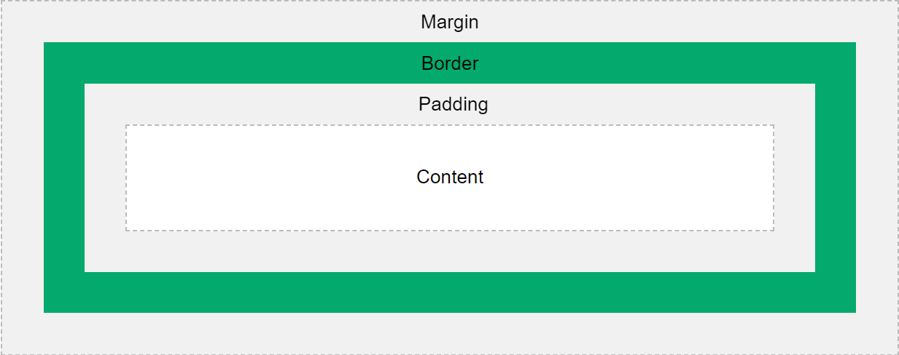
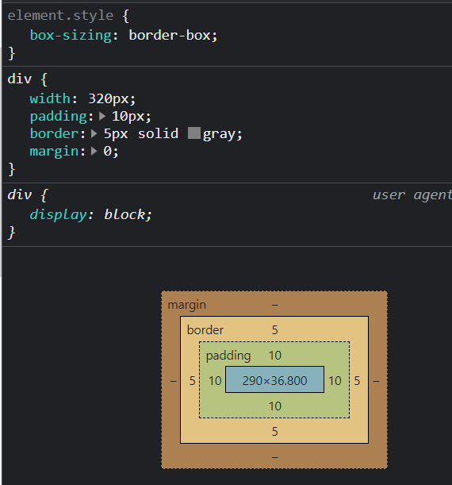
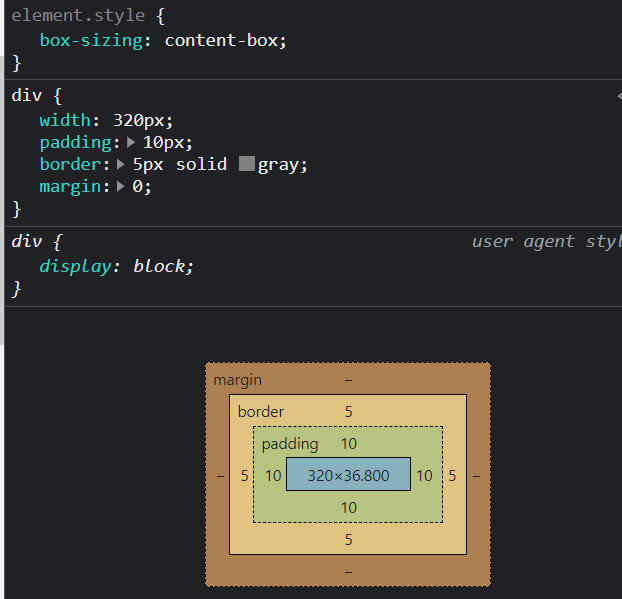

# CSS

## Como aplicar css no html

- Inline
- Tag Style
- Arquivo .css

## Seletores

- Elementos
- Classes
- Id
- Agrupamentos(com vírgula)
- elemento.classe
- elemento > elemento
- elemento elemento
- etc

## Comentários

- Utiliza-se /* */ ou //

## Cores

- Hexadecimal (#FFFFFF, #00AB44)
- rgb (255, 99, 101)
- hsl (9, 100%, 64%)
- color -> cor do texto
- background-color -> cor do fundo do elemento
- border-color -> cor da borda do elemento
- etc

## Unidades

- Absolutas
  * px
  * pt
- Relativas
  * %
  * em
  * rem
  * vh (viewport height)
  * vw (viewport width)
  * vmin
  * vmax

## Background

- background
- background-color
- background-image
- background-size
- background-position
- background-repeat

## Border

- border
- border-color
- border-width
- border-style
  * dotted
  * dashed
  * solid
  * inset
  * etc
- lados da borda
  * border-top
  * border-right
  * etc
- border-radius

## Margin

- margin-top
- margin-right
- margin-bottom
- margin-left
- margin: auto

## Padding

- padding-top
- padding-right
- etc
- não tem auto

## Height e Width

- height, width
- max-height/width
- min-height/width

## Box model

- Como calcular a *verdadeira* altura e largura de um elemento?
  * Depende de como está configurada a propriedade *box-sizing*
  * Na maioria dos casos, ela está como border-box. Exemplo:
  
  * Nesse caso, o padding faz parte da largura e altura, e a borda é um adicional.
  * Existem outras configurações, como content-box: nesse caso, o padding não faz parte do conteúdo e deve-se adicionar seu tamanho no cálculo. Exemplo:
  

  
## Formatação de texto

- font-size
- font-weight
- font-family
  - fontes padrão
  - fontes baixadas
  - fontes importadas do google
- text-decoration
  * underline
  * overline
  * line-through
- text-shadow
- text-align
  * left
  * right
  * center
  * justify

## Display

- none (alternativa: visibility: hidden)
- block
- inline
- inline-block

## Position

- valores da propriedade position
  - static
  - relative
  - fixed
  - absolute
  - sticky
- propriedades(só funcionam caso o elemento tenha valor definido de position)
  - top
  - bottom
  - left
  - right

## Z-index

- Determina qual elemento ficará em cima do outro.

